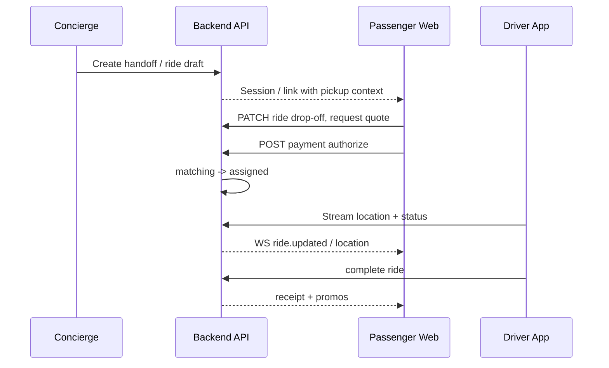
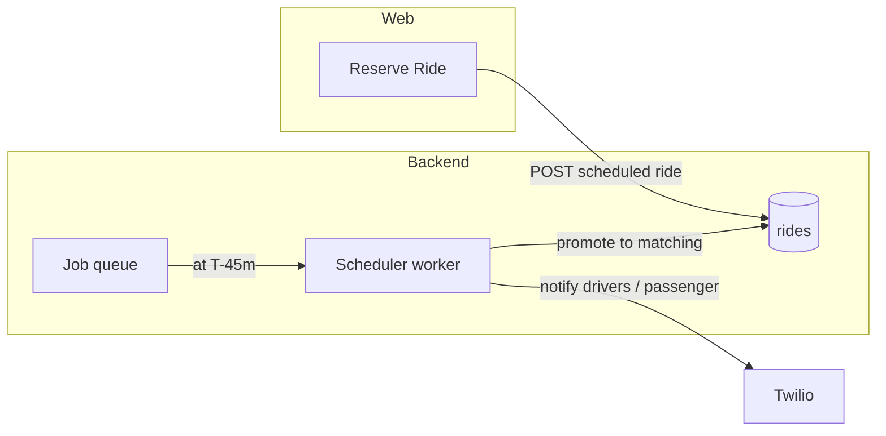
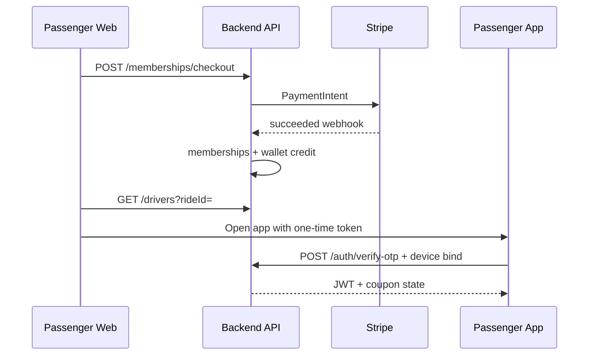
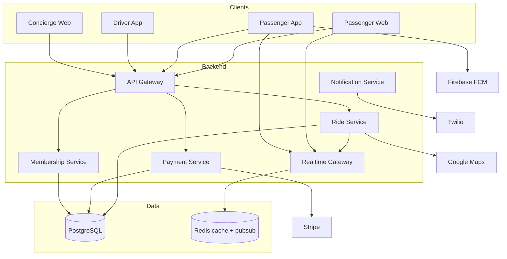

# Tuxedo — full backend design document

This document is the single backend specification for the **passenger web app** (`findingchaufer-passenger-frontend`). It replaces ad‑hoc `localStorage` and mock data with a real platform: **who may do what**, **money and membership rules**, **data model**, **APIs**, **real-time tracking**, **integrations**, and **errors**.

**Canonical product sources in this repo**

- Ride and user shapes: `src/types/index.ts`
- Driver list shape (mock): `src/data/mockDrivers.ts`
- Fare helper (server should own the real rule engine): `src/utils/pricing.ts`
- Flows: `src/screens/*.tsx`

**Note on numbers:** The **track-ride** screen shows a fixed **$24 + $3 = $27** example for payment review. `pricing.ts` uses **$45** base fare and **15%** commission. Treat **$45 / 15%** as the **rule-engine defaults** unless product standardizes on one; the backend should read fares from **config + quote service**, not hard-code UI copy.

---

## 1. Product overview

### 1.1 What the backend replaces

| Today (frontend only) | Backend responsibility |
|------------------------|-------------------------|
| `localStorage` (`isMember`, coupon blobs) | **Membership**, **wallet/credit**, **coupons** persisted and audited |
| `AppContext` user / active ride | **Authenticated sessions**, **ride as source of truth** |
| `mockDrivers` | **Driver directory**, availability, assignment, location stream |
| Simulated map / ETA | **Live location** ingest (driver app), **ETA** from routing |
| Router `location.state` for handoffs | **Stable ride and checkout IDs** linked across web → app |
| Deep link `?pickup=` | **Validated pickup** tied to hotel / concierge session |

### 1.2 Core business numbers (one place)

| Item | Value / rule | Source |
|------|----------------|--------|
| **Gold membership** | **$100 / year** | `MembershipScreen.tsx` |
| **Signup credit** | **$100** ride credit included with Gold purchase | `MembershipScreen`, `MembershipPaymentScreen` |
| **Member promo (UI)** | **20% off next journey** after certain flows | `PassengerTrackingWeb.tsx` |
| **App download offer** | **$100 coupon** (code pattern `TUX100-XXXXXX`) pending app login | `PassengerTrackingWeb` popup |
| **Payment review (demo line items)** | Ride **$24**, service fee **$3**, total **$27** | `PassengerTrackingWeb` secure payment step |
| **Default pickup label** | Hotel name, e.g. “The Grand Majestic Hotel” | Screens / state |
| **Pricing engine (code)** | Base fare **$45**; cash multiplier **×1.2**; commission **15%** of fare | `src/utils/pricing.ts` |
| **Vehicle classes** | `sedan`, `suv`, `luxury`, `van` | `src/types/index.ts` |
| **Ride payment categories** | `card`, `cash` (typed); UI also shows Apple Pay, PayPal as **methods** | Types + screens |
| **Gold benefits (marketing list)** | Manual chauffeur selection; full amenities; advanced filters; priority dispatch; exclusive fleet access | `MembershipScreen.tsx` |
| **Driver filters (member)** | Hotel-preferred only; verified only; min rating **4.5**; max distance **5** mi | `DriverListScreen.tsx` |
| **KYC** | `pending` / `approved` / `rejected` on user | `src/types/index.ts` |

### 1.3 Ride lifecycle (canonical states)

Aligned with `RideStatus` in `src/types/index.ts`:

`creating` → `matching` → `assigned` → `arriving` → `onboard` → `enroute` → `completed` **or** `cancelled` at defined gates.

---

## 2. User roles and permissions

### 2.1 Roles

| Role | Primary client | Exists in repo types |
|------|----------------|----------------------|
| **passenger** | Web / app | Yes |
| **concierge** | Hotel desk / concierge tool (future) | Yes |
| **manager** | Hotel or fleet ops (future) | Yes |
| **driver** | Driver app (future) | Implied by product; extend RBAC beyond `UserRole` union when driver auth ships |

### 2.2 Permission matrix (summary)

| Action | passenger | concierge | manager | driver |
|--------|-----------|-------------|---------|--------|
| Create ride for self | Yes | No | No | No |
| Create / attach ride for guest (pickup, guest link) | No | Yes | Yes (policy) | No |
| Edit pickup on active ride | No | Yes (policy) | Yes | No |
| Edit drop-off | Yes (own) | Yes (assisted) | Yes | No |
| Pay ride / membership | Yes (own) | No | No | No |
| See driver list (summary) | Yes | Yes (support) | Yes | N/A |
| See **full** driver profile + amenities | **If Gold** | Yes (support) | Yes | Own profile |
| Use **filters** on driver list | **If Gold** | N/A | N/A | N/A |
| **Select** chauffeur manually | **If Gold** + ride in eligible state | No | Yes (override) | Accept / reject offer |
| Update ride GPS / phase | No | No | No | Yes |
| Issue refunds / adjust credit | No | No | Yes | No |
| Read audit / commission reports | No | No | Yes | No |

**Membership gate:** “Full amenities” and “filters” match the frontend: non‑members see locked UI until Gold is active.

---

## 3. End-to-end flow diagrams (narrative)

### 3.1 Flow A — Instant ride (concierge → backend → passenger web)

1. **Concierge** creates a **guest handoff**: hotel, default pickup address or place ID, optional guest phone/email, optional deep-link token.
2. Backend issues a **short-lived passenger session** or magic link; passenger opens **`/track-ride?pickup=...`**.
3. Passenger enters **drop-off**; backend creates `ride` in `creating`, stores pickup (locked unless concierge), drop-off, requested vehicle default.
4. Passenger chooses **payment method**; backend creates **payment intent** (or records `cash` / `pending`).
5. On success, ride → `matching` → auto-assign or wait for Gold manual path.
6. Assigned driver: ride `assigned` → `arriving` (driver location stream).
7. Pickup: `onboard` → `enroute` → `completed`; commission and ledger posted.
8. Post-ride: optional **20% promo** flag, **coupon** for app if campaign applies.



### 3.2 Flow B — Scheduled ride (including background promotion)

1. Passenger completes **`/reserve-ride`**: date, time, pickup context.
2. Backend creates **`rides`** row with `scheduled_pickup_at`, status `creating` or a dedicated **`scheduled`** sub-state (implementation choice: either keep `creating` until window, or add `scheduled`—if added, document migration from frontend union).
3. **Scheduler worker** (cron / queue): at `T - X` minutes (config, e.g. 45), transition to **dispatch window**: notify drivers, open `matching`, optionally **pre-auth** payment per policy.
4. When driver assigned, same real-time path as instant ride.



### 3.3 Flow C — Gold membership (web → backend → app activation)

1. Passenger hits **`/membership`** → **`/membership-payment`**.
2. Backend creates **membership checkout** ($100), ties to `user_id` or pre-account phone.
3. Payment captured via Stripe; backend inserts **`memberships`** (active, `expires_at = now + 1y`), credits **`wallet_ledger`** +$100, sets `users.is_member` / tier.
4. Passenger redirected to **driver list** with ride context preserved (`paymentMethod`, ride id).
5. **App activation:** optional **OTP** links phone; first app login **binds device**, marks coupon `redeemed` or `linked_user`.



---

## 4. System architecture

### 4.1 Logical diagram



### 4.2 Suggested technology stack

| Layer | Choice | Role |
|-------|--------|------|
| API | Node (Nest/Fastify) or Go | REST + auth |
| Realtime | Socket.io or WS + Redis adapter | Driver location, ride updates |
| DB | PostgreSQL | ACID, relational model below |
| Cache / pubsub | Redis | sessions, rate limits, WS fanout |
| Jobs | BullMQ / Temporal / cloud scheduler | scheduled ride promotion |
| Payments | Stripe | cards, wallets via Stripe |
| SMS / voice OTP | Twilio | OTP, ride updates |
| Push | Firebase Cloud Messaging | passenger/driver push |
| Maps | Google Maps Platform | geocode, directions, ETA |
| Object storage | S3-compatible | receipts, KYC docs (optional) |

---

## 5. Database schema (11 tables, PostgreSQL)

**Conventions:** `uuid` PKs, `timestamptz`, soft delete only where noted. Adjust names to your ORM.

### 5.1 `hotels`

```sql
CREATE TABLE hotels (
  id UUID PRIMARY KEY DEFAULT gen_random_uuid(),
  name TEXT NOT NULL,
  default_pickup_address TEXT,
  default_pickup_place_id TEXT,
  commission_bps INT NOT NULL DEFAULT 1500, -- basis points; align with product
  active BOOLEAN NOT NULL DEFAULT true,
  created_at TIMESTAMPTZ NOT NULL DEFAULT now()
);
```

### 5.2 `users`

```sql
CREATE TYPE user_role AS ENUM ('passenger', 'concierge', 'manager');
CREATE TYPE kyc_status AS ENUM ('pending', 'approved', 'rejected');

CREATE TABLE users (
  id UUID PRIMARY KEY DEFAULT gen_random_uuid(),
  hotel_id UUID REFERENCES hotels(id),
  role user_role NOT NULL,
  email TEXT UNIQUE,
  phone TEXT UNIQUE,
  full_name TEXT NOT NULL,
  kyc_status kyc_status NOT NULL DEFAULT 'pending',
  is_member BOOLEAN NOT NULL DEFAULT false,
  member_tier TEXT, -- e.g. 'gold'
  created_at TIMESTAMPTZ NOT NULL DEFAULT now()
);
CREATE INDEX idx_users_hotel ON users(hotel_id);
```

### 5.3 `user_devices` (device binding)

```sql
CREATE TABLE user_devices (
  id UUID PRIMARY KEY DEFAULT gen_random_uuid(),
  user_id UUID NOT NULL REFERENCES users(id) ON DELETE CASCADE,
  platform TEXT NOT NULL, -- ios, android, web
  device_fingerprint TEXT NOT NULL,
  device_name TEXT,
  bound_at TIMESTAMPTZ NOT NULL DEFAULT now(),
  last_seen_at TIMESTAMPTZ,
  UNIQUE (user_id, device_fingerprint)
);
```

### 5.4 `drivers`

```sql
CREATE TYPE driver_status AS ENUM ('offline', 'online', 'busy');

CREATE TABLE drivers (
  id UUID PRIMARY KEY DEFAULT gen_random_uuid(),
  user_id UUID UNIQUE REFERENCES users(id), -- optional link if drivers share user table
  display_name TEXT NOT NULL,
  rating NUMERIC(3,2) NOT NULL DEFAULT 5.0,
  years_experience INT NOT NULL DEFAULT 0,
  verified BOOLEAN NOT NULL DEFAULT false,
  hotel_preferred BOOLEAN NOT NULL DEFAULT false,
  status driver_status NOT NULL DEFAULT 'offline',
  current_lat DOUBLE PRECISION,
  current_lng DOUBLE PRECISION,
  updated_at TIMESTAMPTZ NOT NULL DEFAULT now()
);
```

### 5.5 `driver_vehicles`

```sql
CREATE TYPE vehicle_type AS ENUM ('sedan', 'suv', 'luxury', 'van');

CREATE TABLE driver_vehicles (
  id UUID PRIMARY KEY DEFAULT gen_random_uuid(),
  driver_id UUID NOT NULL REFERENCES drivers(id) ON DELETE CASCADE,
  vehicle_type vehicle_type NOT NULL,
  brand TEXT NOT NULL,
  model TEXT NOT NULL,
  year INT NOT NULL,
  color TEXT NOT NULL,
  interior TEXT,
  plate_masked TEXT NOT NULL, -- never store full plate in clear if policy requires
  amenities_json JSONB NOT NULL DEFAULT '{}',
  is_primary BOOLEAN NOT NULL DEFAULT true
);
CREATE INDEX idx_driver_vehicles_driver ON driver_vehicles(driver_id);
```

### 5.6 `rides`

```sql
CREATE TYPE ride_status AS ENUM (
  'creating', 'matching', 'assigned', 'arriving', 'onboard', 'enroute', 'completed', 'cancelled'
);
CREATE TYPE payment_type AS ENUM ('card', 'cash');

CREATE TABLE rides (
  id UUID PRIMARY KEY DEFAULT gen_random_uuid(),
  passenger_user_id UUID REFERENCES users(id),
  hotel_id UUID REFERENCES hotels(id),
  created_by_user_id UUID REFERENCES users(id), -- concierge/manager/passenger
  status ride_status NOT NULL DEFAULT 'creating',
  pickup_address TEXT NOT NULL,
  pickup_place_id TEXT,
  dropoff_address TEXT,
  dropoff_place_id TEXT,
  vehicle_type vehicle_type NOT NULL DEFAULT 'luxury',
  payment_type payment_type,
  payment_method_label TEXT, -- Apple Pay, PayPal, etc.
  fare_amount_cents INT,
  service_fee_cents INT,
  commission_cents INT,
  assigned_driver_id UUID REFERENCES drivers(id),
  scheduled_pickup_at TIMESTAMPTZ,
  created_at TIMESTAMPTZ NOT NULL DEFAULT now(),
  completed_at TIMESTAMPTZ
);
CREATE INDEX idx_rides_passenger ON rides(passenger_user_id);
CREATE INDEX idx_rides_status ON rides(status);
CREATE INDEX idx_rides_scheduled ON rides(scheduled_pickup_at) WHERE scheduled_pickup_at IS NOT NULL;
```

### 5.7 `payments`

```sql
CREATE TYPE payment_kind AS ENUM ('ride', 'membership');
CREATE TYPE payment_status AS ENUM ('requires_action', 'processing', 'succeeded', 'failed', 'refunded');

CREATE TABLE payments (
  id UUID PRIMARY KEY DEFAULT gen_random_uuid(),
  ride_id UUID REFERENCES rides(id),
  user_id UUID NOT NULL REFERENCES users(id),
  kind payment_kind NOT NULL,
  provider TEXT NOT NULL DEFAULT 'stripe',
  provider_intent_id TEXT,
  amount_cents INT NOT NULL,
  currency TEXT NOT NULL DEFAULT 'usd',
  status payment_status NOT NULL,
  raw_json JSONB,
  created_at TIMESTAMPTZ NOT NULL DEFAULT now()
);
CREATE INDEX idx_payments_ride ON payments(ride_id);
```

### 5.8 `memberships`

```sql
CREATE TABLE memberships (
  id UUID PRIMARY KEY DEFAULT gen_random_uuid(),
  user_id UUID NOT NULL REFERENCES users(id) ON DELETE CASCADE,
  tier TEXT NOT NULL DEFAULT 'gold',
  price_cents INT NOT NULL DEFAULT 10000,
  credit_granted_cents INT NOT NULL DEFAULT 10000,
  starts_at TIMESTAMPTZ NOT NULL,
  expires_at TIMESTAMPTZ NOT NULL,
  payment_id UUID REFERENCES payments(id),
  active BOOLEAN NOT NULL DEFAULT true
);
CREATE INDEX idx_memberships_user ON memberships(user_id);
```

### 5.9 `wallet_ledger`

```sql
CREATE TYPE ledger_entry_type AS ENUM ('credit_grant', 'ride_debit', 'refund', 'adjustment', 'expire');

CREATE TABLE wallet_ledger (
  id UUID PRIMARY KEY DEFAULT gen_random_uuid(),
  user_id UUID NOT NULL REFERENCES users(id) ON DELETE CASCADE,
  ride_id UUID REFERENCES rides(id),
  type ledger_entry_type NOT NULL,
  amount_cents INT NOT NULL, -- positive adds spendable credit; negative debits
  balance_after_cents INT,
  memo TEXT,
  created_at TIMESTAMPTZ NOT NULL DEFAULT now()
);
CREATE INDEX idx_wallet_user ON wallet_ledger(user_id, created_at DESC);
```

### 5.10 `coupons`

```sql
CREATE TYPE coupon_status AS ENUM ('issued', 'pending_app_login', 'redeemed', 'expired', 'void');

CREATE TABLE coupons (
  id UUID PRIMARY KEY DEFAULT gen_random_uuid(),
  code TEXT UNIQUE NOT NULL,
  user_id UUID REFERENCES users(id),
  amount_cents INT NOT NULL DEFAULT 10000,
  status coupon_status NOT NULL DEFAULT 'issued',
  campaign TEXT, -- app_download, membership_bonus, etc.
  expires_at TIMESTAMPTZ,
  redeemed_at TIMESTAMPTZ,
  created_at TIMESTAMPTZ NOT NULL DEFAULT now()
);
```

### 5.11 `otp_challenges`

```sql
CREATE TYPE otp_channel AS ENUM ('sms', 'email');

CREATE TABLE otp_challenges (
  id UUID PRIMARY KEY DEFAULT gen_random_uuid(),
  user_id UUID REFERENCES users(id),
  phone_e164 TEXT,
  email TEXT,
  channel otp_channel NOT NULL,
  code_hash TEXT NOT NULL,
  expires_at TIMESTAMPTZ NOT NULL,
  consumed_at TIMESTAMPTZ,
  attempts INT NOT NULL DEFAULT 0,
  created_at TIMESTAMPTZ NOT NULL DEFAULT now()
);
CREATE INDEX idx_otp_phone ON otp_challenges(phone_e164, created_at DESC);
```

---

## 6. API reference

**Base URL:** `https://api.example.com/v1`  
**Auth:** `Authorization: Bearer <access_token>` except **public tracking** (Section 9).

### 6.1 Auth and session

| Method | Path | Description |
|--------|------|-------------|
| POST | `/auth/otp/send` | Send OTP (Twilio / email) |
| POST | `/auth/otp/verify` | Verify OTP, returns JWT pair |
| POST | `/auth/refresh` | Refresh access token |
| POST | `/auth/devices` | Register / bind device fingerprint |
| POST | `/auth/handoffs` | Concierge: create passenger handoff token |

**POST `/auth/otp/send` — request**

```json
{
  "channel": "sms",
  "phoneE164": "+15551234567"
}
```

**POST `/auth/otp/verify` — request / response**

```json
{ "phoneE164": "+15551234567", "code": "482931" }
```

```json
{
  "accessToken": "eyJ...",
  "refreshToken": "eyJ...",
  "user": { "id": "uuid", "role": "passenger", "hotelId": "uuid", "isMember": true, "rideCreditCents": 10000 }
}
```

**What happens on the backend:** Constant-time compare of `code_hash`, increment `otp_challenges.attempts`, lockout after N failures, issue JWT with `sub`, `role`, `hotel_id`, `device_bound` claim if applicable.

### 6.2 Rides

| Method | Path | Description |
|--------|------|-------------|
| POST | `/rides` | Create ride (passenger or concierge) |
| GET | `/rides/:id` | Ride detail |
| PATCH | `/rides/:id` | Update drop-off, vehicle, notes (policy) |
| POST | `/rides/:id/quote` | Fare + fee + commission breakdown |
| POST | `/rides/:id/pay` | Attach payment / confirm |
| POST | `/rides/:id/cancel` | Cancel with reason |
| GET | `/rides/:id/track` | **Public** scoped token (Section 9) |
| POST | `/rides/:id/assign` | Manual assign (member flow) / internal |
| GET | `/rides/:id/drivers` | Candidate drivers + ETA |

**POST `/rides` — request**

```json
{
  "pickupAddress": "The Grand Majestic Hotel",
  "pickupPlaceId": "ChIJ...",
  "dropoffAddress": "JFK Terminal 4",
  "dropoffPlaceId": "ChIJ...",
  "vehicleType": "luxury",
  "scheduledPickupAt": null,
  "handoffToken": "optional-concierge-token"
}
```

**Response**

```json
{
  "id": "ride-uuid",
  "status": "creating",
  "pickupAddress": "The Grand Majestic Hotel",
  "dropoffAddress": "JFK Terminal 4",
  "vehicleType": "luxury"
}
```

**POST `/rides/:id/quote` — response**

```json
{
  "fareCents": 4500,
  "serviceFeeCents": 300,
  "totalCents": 4800,
  "commissionCents": 675,
  "pricingVersion": "2026-01-base"
}
```

**What happens on the backend:** Compute distance/duration via Maps, apply base fare rules (`pricing.ts` alignment), payment-type surcharge (cash ×1.2 on fare component), member discounts if any, persist quote on ride for checkout consistency.

**POST `/rides/:id/pay` — request**

```json
{
  "paymentMethod": "card",
  "stripePaymentMethodId": "pm_123",
  "useWalletCents": 0
}
```

**What happens on the backend:** Create `payments` row, Stripe confirm; on success transition `creating` → `matching`, enqueue dispatch.

### 6.3 Membership

| Method | Path | Description |
|--------|------|-------------|
| POST | `/memberships/checkout` | Create $100 Gold checkout |
| POST | `/memberships/webhook` | Stripe webhook (internal) |
| GET | `/memberships/me` | Current tier + expiry + credit |

**POST `/memberships/checkout` — response**

```json
{
  "clientSecret": "pi_xxx_secret_yyy",
  "membershipPreview": { "priceCents": 10000, "creditGrantedCents": 10000, "tier": "gold" }
}
```

**What happens on the backend:** On `payment_intent.succeeded`, insert `memberships`, append `wallet_ledger` +$100 credit, set `users.is_member = true`.

### 6.4 Drivers (read)

| Method | Path | Description |
|--------|------|-------------|
| GET | `/drivers/nearby` | Query pickup, filters (member-only full amenities in detail) |
| GET | `/drivers/:id` | Profile; amenities masked if not entitled |

**GET `/drivers/nearby?rideId=...&hotelPreferred=true&verifiedOnly=true`**

```json
{
  "drivers": [
    {
      "id": "uuid",
      "displayName": "Michael T.",
      "rating": 4.9,
      "etaMinutes": 3,
      "distanceMiles": 0.8,
      "verified": true,
      "hotelPreferred": true,
      "vehicleSummary": "Black Mercedes S-Class",
      "amenities": null
    }
  ]
}
```

If caller **is Gold**, set `"amenities": { "wifi": true, ... }` per `driver_vehicles.amenities_json`.

### 6.5 Coupons

| Method | Path | Description |
|--------|------|-------------|
| POST | `/coupons/issue` | Campaign-based issue (server-side rules) |
| GET | `/coupons/:code` | Validate (auth) |

---

## 7. Real-time events (WebSocket)

**Namespace:** `/ws`  
**Auth:** Same JWT as API; driver and passenger **subscribe** to `ride:{rideId}`.

### 7.1 Events

| Event name | Emitted by | Received by | Payload (example) |
|------------|------------|-------------|---------------------|
| `ride.updated` | Server | Passenger web/app | `{ "rideId", "status", "assignedDriverId", "fareCents" }` |
| `ride.location` | Server (after driver ingest) | Passenger | `{ "rideId", "lat", "lng", "heading", "speedKph", "at" }` |
| `ride.eta` | Server | Passenger | `{ "rideId", "etaSeconds", "distanceMeters" }` |
| `ride.driver_moving` | Server | Passenger | `{ "rideId", "moving": true }` |
| `dispatch.offer` | Server | Driver app | `{ "rideId", "pickup", "payoutEstimateCents", "expiresAt" }` |
| `dispatch.accepted` | Server | Passenger | `{ "rideId", "driverId" }` |
| `presence.driver` | Server | Ops (optional) | `{ "driverId", "status" }` |

**Driver → server message (ingest)**

```json
{ "type": "location.batch", "rideId": "uuid", "points": [{ "lat": 40.7, "lng": -74.0, "at": "2026-05-04T12:00:00Z" }] }
```

**Server fanout:** Validate driver is `assigned_driver_id` for `rideId`, throttle (e.g. 1 Hz), store last position in Redis, broadcast `ride.location`.

---

## 8. Business logic rules

### 8.1 Fare calculation

1. **Geocoded route** (pickup ↔ drop-off): distance + duration from Maps.
2. **Base fare** defaults from config; align with `BASE_FARE` ($45) unless overridden per market.
3. **Cash surcharge:** if `payment_type === cash`, fare component × **1.2** (per `calculateFare`).
4. **Service fee:** additive line item (UI used $3; make configurable `SERVICE_FEE_CENTS`).
5. **Member discounts:** e.g. promo **20% off next ride** stored on user or ride flag; apply to fare or total per campaign rules.
6. **Wallet:** `useWalletCents` reduces Stripe charge; ledger `ride_debit` on capture.
7. **Commission:** `commission = fare * COMMISSION_RATE` (15% of fare in `pricing.ts`); hotel share may be split from `commission_bps` on `hotels`.

### 8.2 Ride status machine

| From | To | Guard |
|------|-----|--------|
| creating | matching | Payment succeeded or cash accepted per policy |
| matching | assigned | Driver assigned (auto or manual) |
| assigned | arriving | Driver en route |
| arriving | onboard | Arrived at pickup geo-fence |
| onboard | enroute | Passenger picked up |
| enroute | completed | Arrived at drop-off |
| * | cancelled | Policy window + payment reversal rules |

Invalid transitions return **`RIDE_INVALID_STATE`** (Section 11).

### 8.3 Driver assignment priority

1. **Member manual path:** passenger-chosen driver → create `dispatch.offer` with timeout; fallback to auto if declined/expired.
2. **Auto dispatch:** score = `hotelPreferred` boost + rating + ETA + distance + fleet tier; exclude `busy` / `offline`.
3. **Concierge priority flag** (optional future): boost certain partners.

### 8.4 Membership rules

- **Price:** $100/year (`memberships.price_cents`).
- **Credit:** $100 granted once per successful purchase (`credit_granted_cents`), posted to `wallet_ledger`.
- **Entitlements:** `is_member` true while `active` membership and `expires_at > now()`.
- **Renewal:** optional auto-renew via Stripe subscription (separate product); else manual repurchase.

### 8.5 Coupon lifecycle

1. **issued** at creation (unique code).
2. **pending_app_login** when linked to phone/email but app not verified.
3. **redeemed** when applied to a ride or wallet once.
4. **expired** by cron on `expires_at`.
5. **void** by support.

One active **pending_app_login** coupon per user per campaign (configurable).

### 8.6 OTP rules

- **Length:** 6 digits.
- **TTL:** 10 minutes default.
- **Max attempts:** 5 per challenge; then new challenge required.
- **Resend cooldown:** 60 seconds per channel/destination.
- **Rate limit:** per IP + per phone (Section 9).

---

## 9. Security and authentication

### 9.1 JWT strategy

- **Access token:** 15 min, RS256 or ES256, claims: `sub`, `role`, `hotel_id`, `is_member`, `device_bound`.
- **Refresh token:** 30 days, rotation on use, stored hashed server-side or in secure cookie for web.

### 9.2 Device binding

- On first app login after OTP, register `user_devices` with fingerprint + platform.
- Sensitive actions (e.g. large wallet debit) may require **recent** device or step-up OTP.

### 9.3 RBAC (enforcement)

Enforce at **gateway middleware** using `role` claim + route metadata table (conceptually):

| Route pattern | passenger | concierge | manager | driver |
|---------------|-----------|-----------|---------|--------|
| `POST /rides` | own | guest | yes | no |
| `PATCH /rides/:id/pickup` | no | yes | yes | no |
| `GET /drivers/nearby` | yes | yes | yes | no |
| `GET /drivers/:id` full amenities | if member | yes | yes | own |
| `POST /rides/:id/location` | no | no | no | yes |

### 9.4 Rate limits (indicative)

| Key | Limit |
|-----|--------|
| `POST /auth/otp/send` per IP | 10 / hour |
| `POST /auth/otp/send` per phone | 5 / hour |
| `POST /rides` per user | 30 / day |
| `GET /rides/:id/track` per token | 120 / min |

### 9.5 Public tracking endpoint

- Issue **scoped tracking token** (JWT or opaque) with only `rideId`, `exp`, **no PII**.
- **GET `/rides/:id/track`** returns: driver first initial, vehicle summary, ETA, status, last N locations (thinned)—**hides** passenger phone, full driver plate, payment instrument, internal commission.

---

## 10. Third-party integrations

| Service | When used | Why |
|---------|-----------|-----|
| **Twilio** | OTP SMS, optional ride SMS to guest | Reach users without app |
| **Stripe** | Ride checkout, membership $100, wallet top-up (future) | PCI scope reduction |
| **Firebase (FCM)** | Push: driver assigned, arriving, membership renewal | Mobile engagement |
| **Google Maps** | Geocode addresses, route for ETA, distance matrix for dispatch | Accurate quotes and tracking copy |

---

## 11. Error codes reference

**Format:** `DOMAIN_CODE` — HTTP status suggestion.

### 11.1 Auth (`AUTH_*`)

| Code | HTTP | Meaning |
|------|------|---------|
| `AUTH_INVALID_OTP` | 401 | Wrong or expired code |
| `AUTH_OTP_LOCKED` | 429 | Too many attempts |
| `AUTH_REFRESH_INVALID` | 401 | Refresh token revoked or expired |
| `AUTH_DEVICE_REQUIRED` | 403 | Action requires bound device |

### 11.2 Rides (`RIDE_*`)

| Code | HTTP | Meaning |
|------|------|---------|
| `RIDE_NOT_FOUND` | 404 | Unknown id |
| `RIDE_FORBIDDEN` | 403 | Not owner/concierge/manager |
| `RIDE_INVALID_STATE` | 409 | Illegal transition |
| `RIDE_PAYMENT_REQUIRED` | 402 | Must pay before matching |
| `RIDE_PICKUP_LOCKED` | 403 | Passenger cannot change pickup |
| `RIDE_NO_DRIVERS` | 503 | Empty candidate pool |

### 11.3 Payments (`PAY_*`)

| Code | HTTP | Meaning |
|------|------|---------|
| `PAY_DECLINED` | 402 | Card declined |
| `PAY_INTENT_FAILED` | 400 | Stripe error |
| `PAY_AMOUNT_MISMATCH` | 400 | Client total ≠ server quote |

### 11.4 Membership (`MEM_*`)

| Code | HTTP | Meaning |
|------|------|---------|
| `MEM_ALREADY_ACTIVE` | 409 | Duplicate purchase policy violation |
| `MEM_CHECKOUT_INVALID` | 400 | Bad price or tier |

### 11.5 Drivers (`DRV_*`)

| Code | HTTP | Meaning |
|------|------|---------|
| `DRV_NOT_FOUND` | 404 | |
| `DRV_AMENITIES_LOCKED` | 403 | Non-member requesting full amenities |

### 11.6 Coupons (`CPN_*`)

| Code | HTTP | Meaning |
|------|------|---------|
| `CPN_NOT_FOUND` | 404 | |
| `CPN_EXPIRED` | 410 | |
| `CPN_ALREADY_REDEEMED` | 409 | |

### 11.7 Rate limit (`RATE_*`)

| Code | HTTP | Meaning |
|------|------|---------|
| `RATE_LIMITED` | 429 | Generic throttle |

---

## Appendix — Frontend gaps to close against this spec

- Unify **displayed** checkout totals with **quote** API so web never invents $27 vs $45 drift.
- Pass **`rideId`** through membership and driver selection instead of only router state.
- Consume **`scheduled_pickup_at`** on `/track-ride` after reserve flow.

---

*Document version: 2.0 — full 11-section backend design aligned with `findingchaufer-passenger-frontend`.*
